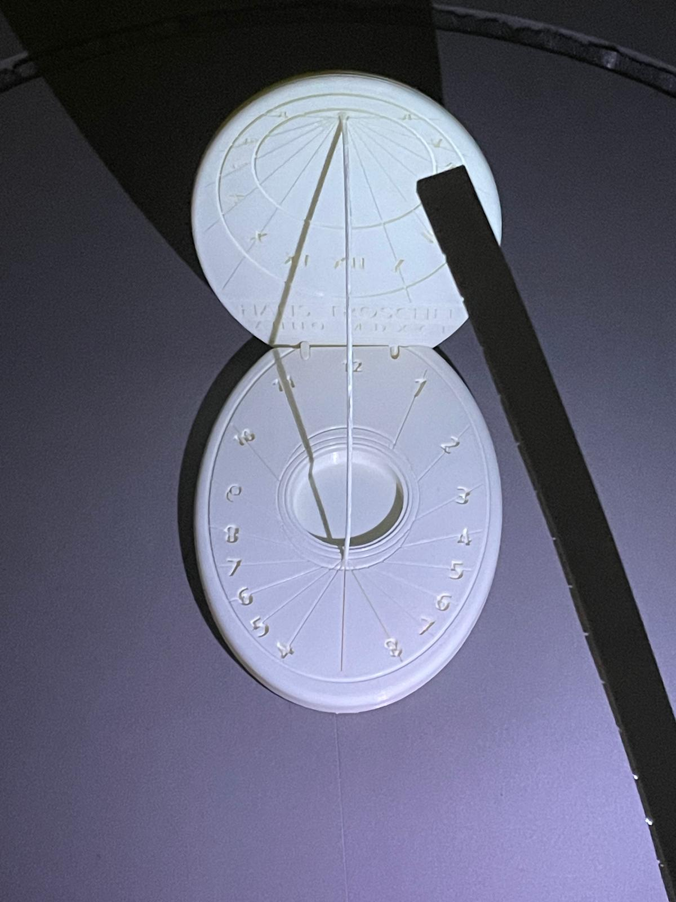

# ceasSolar

Ceas solar interactiv cu Arduino (UNO + stepper L298N + bandă WS2812B): simulează mișcarea Soarelui, spot LED pe ore, comenzi Serial.

Simulez miscarea soarelui pe un cadran solar fizic: o tija (stepper + reductor) urmeaza orele, iar o banda WS2812B (57 LED-uri) creeaza un spot luminos pe fiecare ora. Umbra gnomonului (batul central) cade corect pe cifrele romane, ca la un cadran solar clasic.

## Poze demo

| Ora 11 | Ora 12 | Ora 1 |
|--------|--------|-------|
|  |  |  |

## Hardware
- Arduino UNO
- L298N + stepper cu reductor
- Banda WS2812B (57 LED-uri, DIN pe D3)
- Reed-switch (pastrat in cod pentru licenta; in practica nefolosit)
- Sursa 12V pentru motor (L298N), USB pentru Arduino

## Pinout
| Componenta | Pin |
|---|---|
| Stepper IN1..IN4 | 8, 9, 10, 11 |
| LED strip DIN | 3 |
| Reed | 6 |

## Firmware (comenzi Serial @ 9600)
- `H<n>` – aprinde spotul pentru ora n (1–12)
- `OFF` – stinge toate LED-urile
- `RUN` – impuls scurt la motor (10 pasi), doar demo „motor stricat”
- `STOP` – dezenergizeaza bobinele

## Demo

